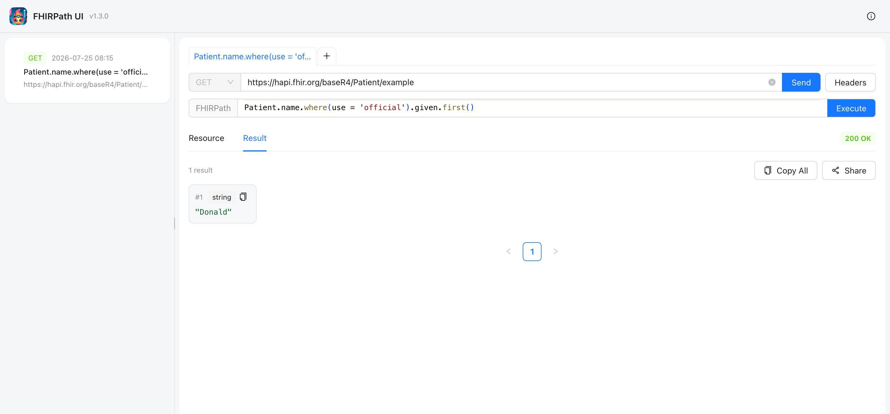

# FHIRPath UI
## Open-source UI for FHIRPath
**Official website**: [https://projkov.github.io/fhirpath-ui/](https://projkov.github.io/fhirpath-ui/)

### Motivation
Lately, I've been working a lot with FHIR IG and FHIR data. I frequently need to check the quality of data, extensions, etc. I found that FHIRPath is a perfect tool to manipulate FHIR data. Sometimes, I need to share the result of a FHIRPath expression for a target FHIR resource with my colleagues for work or educational purposes.

A lot of web services exist with the ability to run FHIRPath expressions. However, I couldn't find a service where I could easily get a resource through a URL, write a FHIRPath expression, and share it. So, I decided to implement it myself. The current version is under development and has many problems, but I hope you find it useful. It's open-source, so you can do anything you want with it.

If you have any ideas on how to improve it, you are welcome to share them. You can email me at prozskov@gmail.com or create an issue on GitHub.

Things that I want to add in the near future:
1. Ability to set a color scheme;
2. Ability to change the font size;
3. Ability to share a custom FHIR resource, not only those available by URL.

Thanks,

Pavel Rozhkov
### Examples
1. [List of combo parameters for Observation resource](https://projkov.github.io/fhirpath-ui?url=https%3A%2F%2Fwww.hl7.org%2Ffhir%2Fus%2Fcore%2FCapabilityStatement-us-core-server.json&expression=CapabilityStatement.rest.resource.where(%0A%20%20%20%20type%3D'Observation').extension.where(%0A%20%20%20%20%20%20%20%20url%3D'http%3A%2F%2Fhl7.org%2Ffhir%2FStructureDefinition%2Fcapabilitystatement-search-parameter-combination'))
2. [List of Patient IDs with gender equal to 'male'](https://projkov.github.io/fhirpath-ui?url=https%3A%2F%2Fserver.fire.ly%2FPatient&expression=Bundle.entry.resource.where(gender%3D'male').id)
### Features
1. Evaluate FHIRPath expressions online, with syntax highlighting for both the expression and the FHIR resource.
2. Retrieve FHIR resources by link.
3. Work on several requests and expressions at once with browser-like tabs.
4. Attach any number of custom request headers per tab (e.g. Authorization).
5. See the HTTP response status of a request at a glance.
6. Share your FHIRPath expressions with colleagues in one click.
7. Share your results.
8. Browse your execution history in the side panel.
9. Open-source.
### Local Development
#### Docker
```bash
docker build -t fhirpath-ui .
docker run -p 8080:80 fhirpath-ui
```

The UI will be available at [http://localhost:8080](http://localhost:8080).

#### YARN
```bash
yarn install
yarn start
```

The UI will be available at [http://localhost:3000](http://localhost:3000).

### Contribute
* **Found or want some new features?** Feel free to create issues.
* **Want to contribute?** Feel free to fork the repository and send merge requests.
* **Anything else?** You can write an email to me at prozskov@gmail.com.

### Want to use it?
1. Use the official website [https://projkov.github.io/fhirpath-ui/](https://projkov.github.io/fhirpath-ui/).
2. Use this source code.

### References
1. [FHIRPath documentation](https://build.fhir.org/fhirpath.html)
2. [FHIRPath implementation by beda.software](https://github.com/beda-software/fhirpath-py)
